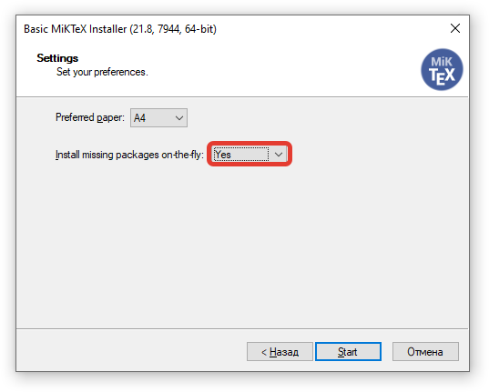
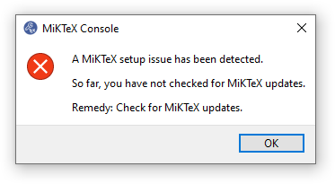
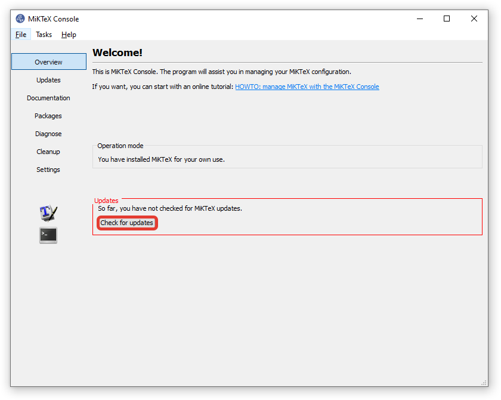
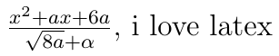

# Проект по теме PyQT5

## **[Файлы проекта](https://drive.google.com/drive/folders/1lGUguS5ji3sUlY2HJJHIBRflXiPu_xa1?usp=sharing)**

# ОБЯЗАТЕЛЬНО К ПРОЧТЕНИЮ

Перед использованием данного приложения скачайте MikTex с [официального сайта](https://miktex.org/download).

Обязательно выберите **Yes** меню `Install missing packages on the fly`.
Остальные параметры можно оставить по умолчанию. Затем откройте приложение MikTex Console.
Если выпало такое предупреждение,

Нажмите `OK`, затем нажмите `Check for updates`.

Затем, появится ссылка с текстом `Updates page`.
Перейдите по ссылке, откроется окно, нажмите `Update now`.
После завершения закройте все окна.
Теперь вы можете использовать данное приложение.
Но учтите, что при первом использовании приложение будет работать медленнее, чем обычно, так как
устанавливаются необходимые пакеты Latex.

# КРАТКОЕ РУКОВОДСТВО LATEX

Математические формулы заключаются в знаки `$$`, обычный текст пишется без долларов.

Этот код `$\frac{x^2 + ax + 6a}{\sqrt{8a} + \alpha}$, i love latex` сгенерирует

Справочник по символам Latex доступен в приложении.

Также не забывайте, что для генерации PDF и PNG обязательно добавить в документ преамбулу (в приложении есть встроенная).